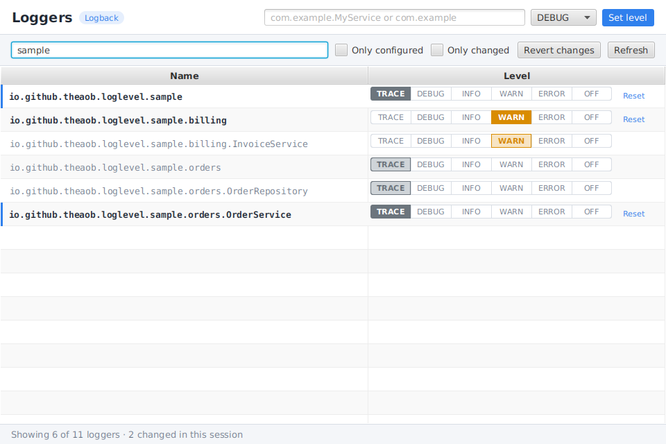

# Runtime Log Level Manager

Kotlin/JavaFX uygulamalarında logger seviyelerini **çalışma anında** değiştirmek için drop-in
kütüphane. Spring Boot Admin'in *Loggers* ekranına benzer bir pencereyi uygulamanın içinden açar.



- Logback, Log4j2 ve java.util.logging desteği; hangisini kullandığınız otomatik algılanır
  (SLF4J bağlaması → Log4j2 core → JUL sırasıyla).
- Filtreleme, sadece yapılandırılmış / sadece bu oturumda değişen loggerları gösterme.
- Tek tıkla seviye değiştirme, `Reset` ile üst loggerdan miras almaya dönme.
- Henüz oluşturulmamış bir sınıf ya da paket için isimle seviye atama.
- `Revert changes` ile oturumdaki tüm değişiklikleri geri alma.
- Ek bağımlılık getirmez: JavaFX ve loglama kütüphanesi uygulamanızdan gelir.

## Kurulum

JitPack üzerinden:

```kotlin
// settings.gradle.kts
dependencyResolutionManagement {
    repositories {
        mavenCentral()
        maven("https://jitpack.io")
    }
}

// build.gradle.kts
dependencies {
    implementation("com.github.theaob.runtime-log-level-manager:log-level-manager:<tag veya commit>")
}
```

Yerel olarak kullanmak için: `./gradlew :log-level-manager:publishToMavenLocal` ve
`implementation("com.github.theaob:log-level-manager:0.1.0")` (`mavenLocal()` reposu ile).

Gereksinimler: Java 11+, JavaFX 17+ (`javafx.controls`).

## Kullanım

```kotlin
override fun start(stage: Stage) {
    stage.scene = Scene(root)

    // Ctrl+Shift+L (macOS'ta Cmd+Shift+L) ile pencereyi açar
    LogLevelManager.install(stage.scene)

    // ya da bir menüye ekleyin
    menuBar.menus += Menu("Tools", null, LogLevelManager.createMenuItem())

    stage.show()
}
```

Diğer seçenekler:

```kotlin
LogLevelManager.show(ownerWindow)                  // pencereyi doğrudan aç (her thread'den çağrılabilir)
val view = LogLevelManager.createView()            // kendi Tab/Dialog'unuza gömün
LogLevelManager.setLevel(MyService::class, LogLevel.DEBUG)
LogLevelManager.setLevel("com.example.db", LogLevel.TRACE)
LogLevelManager.setLevel("com.example.db", null)    // miras almaya geri dön
LogLevelManager.revertAll()
scene.installLogLevelManager(KeyCombination.keyCombination("F12"))
```

Pencereyi yalnızca geliştirme ya da destek modunda açmak isterseniz `install` çağrısını bir
bayrağın (ör. `-Ddebug.tools=true`) arkasına koymanız yeterli.

### Arayüzdeki renkler

- **Dolu buton**: seviye bu loggerda açıkça ayarlanmış (`Reset` görünür).
- **Çerçeveli buton**: seviye bir üst loggerdan miras alınıyor.
- **Solda mavi çizgi**: logger bu oturumda değiştirildi.

## Notlar

- Değişiklikler kalıcı değildir; uygulama yeniden başladığında konfigürasyon dosyanız geçerli olur.
  Logback'in `scan="true"` ya da Log4j2'nin `monitorInterval` özelliği dosyayı yeniden yüklerse
  arayüzden yapılan değişiklikler de sıfırlanır.
- **java.util.logging**: handler'ların kendi seviyeleri vardır (varsayılan `ConsoleHandler` INFO).
  Bir loggeri DEBUG/TRACE'e çektiğinizde çıktı görmek için handler seviyesini de düşürmeniz gerekir.
- Farklı bir loglama altyapısı için `LoggingBackend` arayüzünü uygulayıp
  `LogLevelManager.backend = MyBackend()` ile ya da `META-INF/services/io.github.theaob.loglevel.LoggingBackend`
  dosyasıyla kaydedebilirsiniz.
- Modüler (JPMS) uygulamalarda modül adı `io.github.theaob.loglevel`'dir.

## Geliştirme

```bash
./gradlew :log-level-manager:test   # backend testleri
./gradlew :sample:run               # örnek uygulama (Logback)
```
