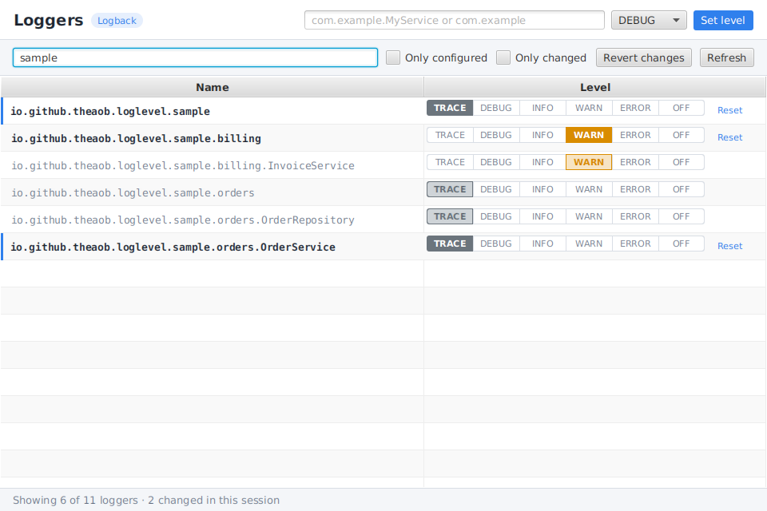

# Runtime Log Level Manager

English · [Türkçe](README.tr.md)

[](https://central.sonatype.com/artifact/tr.com.onurbaykal/log-level-manager)
[](https://github.com/theaob/runtime-log-level-manager/actions/workflows/ci.yml)
[](https://github.com/theaob/runtime-log-level-manager/actions/workflows/release.yml)
[](LICENSE)

Drop-in library for changing logger levels **at runtime** in Kotlin/JavaFX applications. It opens a
window similar to Spring Boot Admin's *Loggers* screen from inside the application.



- Logback, Log4j2 and java.util.logging; the one in use is detected automatically
  (SLF4J binding → Log4j2 core → JUL).
- java.util.logging loggers (JavaFX, the JDK, legacy libraries) are listed next to the Logback or
  Log4j2 ones, tagged `JUL`, and their output can be routed into your appenders with one call.
- Filter loggers, show only configured ones or only those changed in this session.
- Change a level with one click; `Reset` makes the logger inherit from its parent again.
- Set the level of a class or package by name, even before its logger exists.
- `Revert changes` restores everything changed in this session.
- No extra dependencies: JavaFX and the logging framework come from your application.

## Installation

From Maven Central:

```kotlin
dependencies {
    implementation("tr.com.onurbaykal:log-level-manager:<version>")
}
```

To try it locally: `./gradlew :log-level-manager:publishToMavenLocal`, then
`implementation("tr.com.onurbaykal:log-level-manager:0.2.0-SNAPSHOT")` with the `mavenLocal()` repository.

Requirements: Java 17+, JavaFX 17+ (`javafx.controls`).

## Usage

```kotlin
override fun start(stage: Stage) {
    stage.scene = Scene(root)

    // Opens the window with Ctrl+Shift+L (Cmd+Shift+L on macOS)
    LogLevelManager.install(stage.scene)

    // ...or add it to a menu
    menuBar.menus += Menu("Tools", null, LogLevelManager.createMenuItem())

    stage.show()
}
```

Other options:

```kotlin
LogLevelManager.show(ownerWindow)                  // open the window directly (safe from any thread)
val view = LogLevelManager.createView()            // embed in your own Tab or Dialog
LogLevelManager.setLevel(MyService::class, LogLevel.DEBUG)
LogLevelManager.setLevel("com.example.db", LogLevel.TRACE)
LogLevelManager.setLevel("com.example.db", null)    // inherit from the parent again
LogLevelManager.revertAll()
scene.installLogLevelManager(KeyCombination.keyCombination("F12"))
```

To make the window available only in development or support builds, put the `install` call
behind a flag such as `-Ddebug.tools=true`.

### java.util.logging

JavaFX, parts of the JDK (`java.net.http`, `javax.net.ssl`, …) and some libraries log through
java.util.logging (JUL), which Logback and Log4j2 never see. The library handles this in two
steps:

- **Listing.** When Logback or Log4j2 is the main framework, JUL loggers appear in the same
  window tagged `JUL`. Changing a level applies it to the JUL logger too, so the JUL side never
  filters more than the main framework would.
- **Bridging.** `LogLevelManager.bridgeJul()` installs a handler on the JUL root that forwards
  every record to the SLF4J logger of the same name, so JUL output lands in your Logback or
  Log4j2 appenders with your pattern and your levels. The JUL console handler is removed to avoid
  duplicate output (`bridgeJul(removeExistingHandlers = false)` keeps it) and `unbridgeJul()`
  restores everything. It needs `slf4j-api` on the classpath, which Logback and
  `log4j-slf4j2-impl` already bring.

```kotlin
LogLevelManager.bridgeJul()   // once at startup, before the first JUL message you care about
```

#### Level mapping

JUL has no `FATAL` and the manager has no `CONFIG`/`FINER`, so the two sides are mapped by
threshold. The same thresholds are used when a level is written to JUL, when a JUL level is shown
in the window, and when the bridge forwards a record.

| Manager | → written to JUL | ← read from JUL / forwarded by the bridge |
|---|---|---|
| `OFF` | `OFF` | `OFF` |
| `FATAL` | `SEVERE` | — (no JUL equivalent; reads back as `ERROR`) |
| `ERROR` | `SEVERE` (1000) | ≥ 1000 |
| `WARN` | `WARNING` (900) | ≥ 900 |
| `INFO` | `INFO` (800) | ≥ 800 |
| `DEBUG` | `FINE` (500) | ≥ 500, so `CONFIG` (700) and `FINE` |
| `TRACE` | `FINEST` (300) | < 500, so `FINER` (400), `FINEST` and `ALL` |

Custom `Level` subclasses fall into the nearest bucket by their integer value. Note that this
differs from `jul-to-slf4j`, which maps `CONFIG` to `INFO` and `FINER` to `DEBUG`.

### Colors in the UI

- **Filled button**: the level is set explicitly on this logger (`Reset` is shown).
- **Outlined button**: the level is inherited from a parent logger.
- **Blue bar on the left**: the logger was changed in this session.

## Notes

- Changes are not persistent; your configuration file applies again when the application
  restarts. If Logback's `scan="true"` or Log4j2's `monitorInterval` reloads the file, changes
  made through the UI are reset as well.
- **java.util.logging without the bridge**: handlers have their own levels (the default
  `ConsoleHandler` is INFO). After lowering a logger to DEBUG/TRACE you also need to lower the
  handler level to see output. With `bridgeJul()` the main framework's levels apply instead.
- For another logging framework, implement `LoggingBackend` and register it either with
  `LogLevelManager.backend = MyBackend()` or through
  `META-INF/services/tr.com.onurbaykal.loglevelmanager.LoggingBackend`.
- In modular (JPMS) applications the module name is `tr.com.onurbaykal.loglevelmanager`.

## Development

```bash
./gradlew :log-level-manager:test   # backend tests
./gradlew :sample:run               # sample application (Logback)
```

## CI and releases

- `.github/workflows/ci.yml`: runs `./gradlew build` on Linux, Windows and macOS for every push to
  `main` and every pull request.
- `.github/workflows/release.yml`: when a tag starting with `v` is pushed (e.g. `v0.1.0`), signs and
  publishes that version to Maven Central and creates a GitHub release.

```bash
git tag v0.1.0
git push origin v0.1.0
```

### One-time setup

1. Create an account on [central.sonatype.com](https://central.sonatype.com) and add the
   `tr.com.onurbaykal` namespace. Verify it by adding the DNS TXT record the portal gives you to
   the `onurbaykal.com.tr` domain.
2. In the portal, create a user token via *View Account → Generate User Token*.
3. Create a GPG key and upload the public key to a keyserver:

   ```bash
   gpg --quick-gen-key "Onur Baykal <email>" rsa4096 sign 2y
   gpg --list-keys --keyid-format short          # key id, e.g. 1A2B3C4D
   gpg --keyserver keyserver.ubuntu.com --send-keys <KEY_ID>
   gpg --armor --export-secret-keys <KEY_ID>     # value of the SIGNING_KEY secret
   ```

4. Add these repository secrets under *Settings → Secrets and variables → Actions* on GitHub:

   | Secret | Value |
   |---|---|
   | `MAVEN_CENTRAL_USERNAME` | User token username |
   | `MAVEN_CENTRAL_PASSWORD` | User token password |
   | `SIGNING_KEY` | ASCII-armored secret GPG key |
   | `SIGNING_KEY_ID` | Last 8 characters of the key id |
   | `SIGNING_KEY_PASSWORD` | Passphrase of the GPG key |
